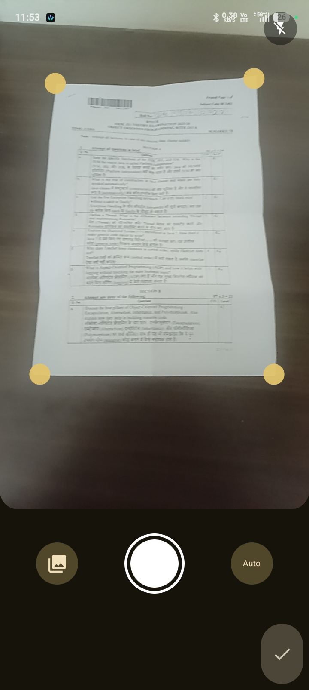
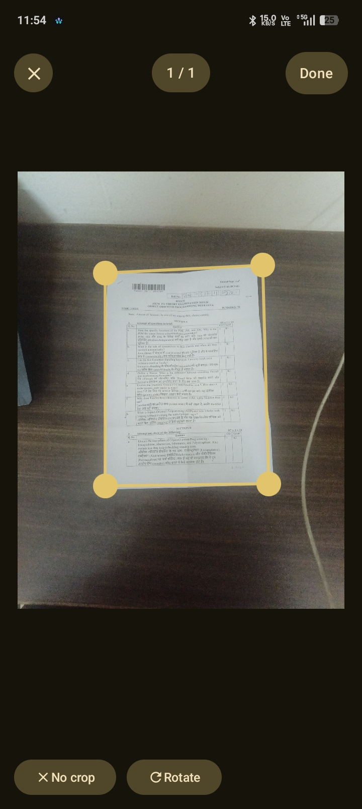
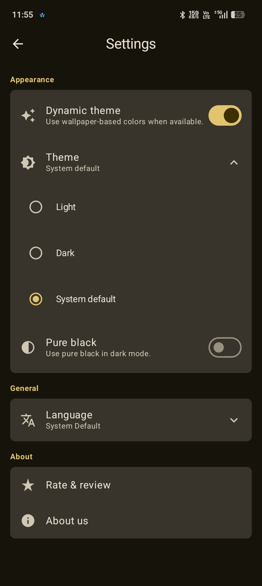
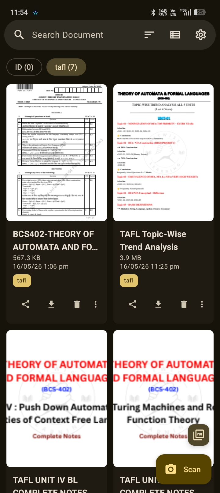

<div align="center">

# Archiv

Archiv is an Android app for managing & and scanning Documents files,
with fast search speed, tagging, importing and sharing directly.

</div>

---

## Features

- **High-Quality Scanning**: Capture documents with precision and ML-powered corner detection.
- **Document Management**: Organize your scanned documents with a powerful tagging system and fast search.
- **PDF Generation**: Convert your scans into high-quality PDF files.
- **Privacy First**: All processing and storage happen locally on your device.
- **Multi-language Support**: Available in English and Hindi.
- **Modern UI**: Built with Jetpack Compose for a smooth and responsive experience.

## Screenshots

<div align="center">
  
  
  
  
</div>

## Tech Stack

- **Language**: [Kotlin](https://kotlinlang.org/)
- **UI Framework**: [Jetpack Compose](https://developer.android.com/jetpack/compose)
- **Database**: [Room](https://developer.android.com/training/data-storage/room)
- **Camera**: [CameraX](https://developer.android.com/training/camerax)
- **Computer Vision**: [OpenCV for Android](https://opencv.org/android/)
- **Machine Learning**: [LiteRT (TensorFlow Lite)](https://ai.google.dev/edge/litert)
- **PDF Creation**: [PDFBox-Android](https://github.com/TomRoush/PdfBox-Android)

## Building From Source

To build Archiv from source, ensure you have the latest version of Android Studio installed.

1. **Clone the repository**:
   ```bash
   git clone https://github.com/armanmaurya/archiv.git
   ```
2. **Open the project** in Android Studio.
3. **Wait for Gradle sync** to complete.
4. **Run the app** on a physical device or emulator.

## Contributing

Contributions are what make the open-source community such an amazing place to learn, inspire, and create. Any contributions you make are greatly appreciated.

Please see [CONTRIBUTING.md](CONTRIBUTING.md) for details on our code of conduct and the process for submitting pull requests.

## Open Source Libraries

Archiv uses the following open-source libraries:

- [Android Jetpack Libraries](https://developer.android.com/jetpack) (Compose, Room, CameraX, Lifecycle, Navigation, etc.)
- [OpenCV](https://opencv.org/) - Open Source Computer Vision Library.
- [LiteRT](https://ai.google.dev/edge/litert) - A cross-platform runtime for on-device AI.
- [PDFBox-Android](https://github.com/TomRoush/PdfBox-Android) - A port of Apache PDFBox for Android.
- [Reorderable](https://github.com/calvinconcept/reorderable) - Drag-and-drop reordering for Jetpack Compose.

## License

This project is licensed under the MIT License - see the [LICENSE](LICENSE) file for details.
